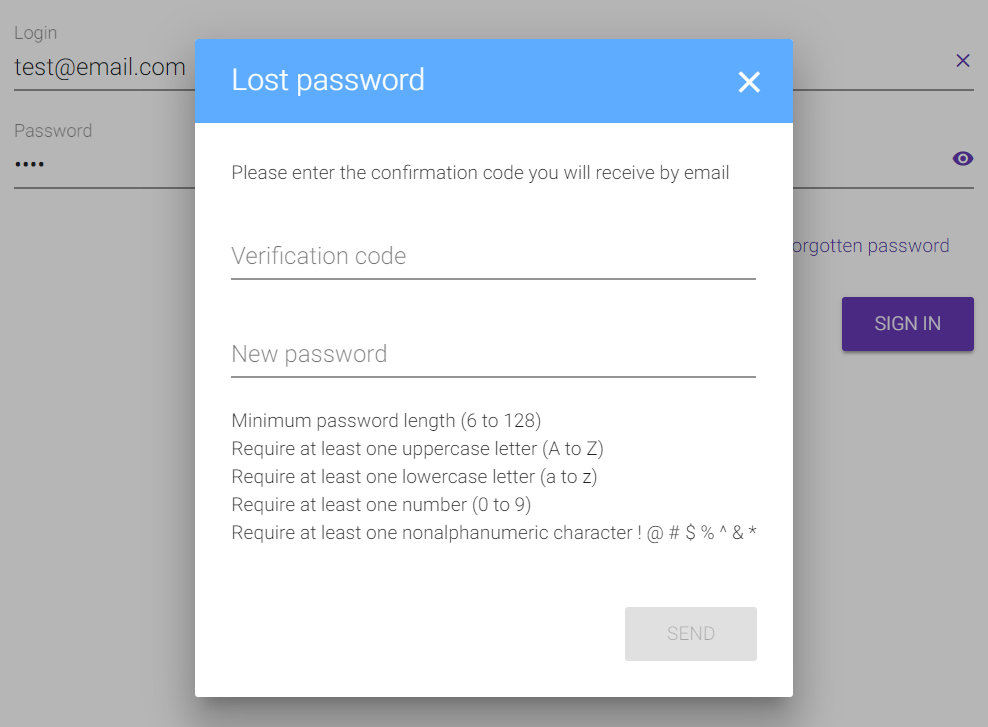

# Login Form Component
> Angular component providing login and password management using [Angular Material](https://material.angular.io) library.

<a href="https://nodei.co/npm/@caliatys/login-form/" target="_blank">
  
</a>

## Example
Check out the **[StackBlitz demo](https://cal-login-component.stackblitz.io/)**

<details>
  <summary>Screenshot</summary>
  <div align=center></div>
</details>

## Installation
Install `@caliatys/login-form` in your project:
```sh
npm install @caliatys/login-form --save
```

Import the `LoginFormModule` inside a `login.module.ts`:
```typescript
import { LoginFormModule } from '@caliatys/login-form';

@NgModule({
  imports: [
    LoginFormModule
  ],
})
export class LoginModule { }
```

## Usage
Add the `cal-login-form` component inside a `login.component.html`:
```html
<cal-login-form #loginForm 
  (initialized)="initialized()" 
  (signUp)="signUp()" 
  (login)="login($event)" 
  (loginSocial)="loginSocial($event)" 
  (forgotPwd)="forgotPassword($event)" 
  (sendFirstPwd)="firstPassword($event)" 
  (sendResetPwd)="lostPassword($event)" 
  (saveMfaKey)="saveMfaKey($event)" 
  (sendMfaCode)="sendMfaCode($event)" 
  (stepUsr)="stepUsr($event)" 
  (stepPwd)="stepPwd($event)">
</cal-login-form>
```

See the example in [src/app/app.component.ts](https://github.com/Caliatys/LoginComponent/blob/master/src/app/app.component.ts)

#### Inputs
```typescript
// Wrap the component inside a container
@Input() fixedWidth        : boolean = false;
// Display login form like Google & Microsoft (step by step)
@Input() googleStyle       : boolean = false;
// Display Google button with the supplied theme : light (by default) / dark 
@Input() googleTheme       : string  = null;
// Display forms inside a layout : tab (by default) / modal / inline
// The inline layout is only available for the MFA form
@Input() customLayouts : any = {
  pwd      : 'modal',
  mfaSetup : 'tab',
  mfa      : 'inline'
};

// Optional policy applied on the username input : email / phone / regex
// Be careful, you must double all the backslashes used in the supplied regex
@Input() customUsrPolicy   : string = null;
// Policies applied on the password input
@Input() customPwdPolicies : any = {
  range : {
    min : 8,
    max : 128,
  },
  char   : true,
  number : true,
  lower  : true,
  upper  : true
};
// Remove password field controls on the login form (except required)
@Input() hidePwdPolicyOnLogin : boolean = false;
// Dislay icon inside inputs on the login form
@Input() customIcons : any = {
  iconUsr       : 'person',
  iconPwd       : 'lock',
  iconVerifCode : 'fingerprint'
};
// Display buttons with events
@Input() customButtons : any = {
  forgotPassword : true,
  signUp         : true,
  google         : true,
  facebook       : true
};
// Display clear & show/hide buttons inside inputs
@Input() customActions : any = {
  clearUsr  : true,
  clearCode : true,
  showPwd   : true
};
// Display error messages
@Input() customErrors : any = {
  login : true,
  pwd   : true,
  mfa   : true
};
// Labels
@Input() customLabels : any = {
  header : {
    titlePwd         : 'Lost password',
    subtitlePwd      : 'Please enter the confirmation code',
    titlePwdSetup    : 'Password setup',
    subtitlePwdSetup : 'Please enter a new password',
    titleMfa         : 'MFA',
    subtitleMfa      : 'Please enter the confirmation code',
    titleMfaSetup    : 'MFA setup',
    subtitleMfaSetup : 'Save this secret key for future connection'
  },
  input : {
    username         : 'Username',
    password         : 'Password',
    verificationCode : 'Verification code',
    newPassword      : 'New password'
  },
  button : {
    signIn         : 'Sign in',
    signUp         : 'Sign up',
    submit         : 'Submit',
    next           : 'Next',
    back           : 'Back',
    send           : 'Send',
    save           : 'Save',
    forgotPassword : 'Forgot password',
    googleSignIn   : 'Sign in with Google',
    facebookSignIn : 'Sign in with Facebook'
  },
  policy : {
    required      : 'This field is required',
    nonWhitespace : 'This value must not contain any spaces',
    email         : 'This value must be an email',
    phone         : 'This value must be a phone number',
    sixDigits     : 'This value must contains six digits',
    customRegex   : 'This value must match the custom regex provided',
    pwdLength     : 'Minimum password length ({{min}} to {{max}})',
    pwdUppercase  : 'Require at least one uppercase letter (A to Z)',
    pwdLowercase  : 'Require at least one lowercase letter (a to z)',
    pwdNumber     : 'Require at least one number (0 to 9)',
    pwdSpecial    : 'Require at least one nonalphanumeric character ! @ # $ % ^ & * ( ) _ + - = [ ] { } | \''
  }
};
```

#### Outputs
```typescript
@Output() initialized  : EventEmitter<any>;
@Output() signUp       : EventEmitter<any>;
@Output() login        : EventEmitter<any>;
/* username : string
*  password : string */
@Output() loginSocial  : EventEmitter<any>;
/* username : string
*  password : string
*  social   : string */
@Output() forgotPwd    : EventEmitter<any>;
/* username : string */
@Output() sendResetPwd : EventEmitter<any>;
/* password : string
*  verificationCode : string */
@Output() sendFirstPwd : EventEmitter<any>;
/* username : string
*  password : string */
@Output() saveMfaKey   : EventEmitter<any>;
/* verificationCode : string */
@Output() sendMfaCode  : EventEmitter<any>;
/* verificationCode : string */
@Output() stepUsr      : EventEmitter<any>;
/* username : string */
@Output() stepPwd      : EventEmitter<any>;
/* username : string
*  password : string */
```

#### Functions
```typescript
// Show functions
// Show MFA form to get verification code.
LoginFormComponent.showMfaForm() : void
// Show MFA setup form to initialize first TOTP (Time-based One-time Password).
LoginFormComponent.showMfaSetupForm(code : string, qrCode : string) : void
// Show password form either to initialize first password or to reset forgot password.
LoginFormComponent.showPwdForm(isFirst : boolean) : void
// Show password input (for google-style form)
LoginFormComponent.showPwdStep(userInfo? : string, userImage? : string) : void

// Hide functions
LoginFormComponent.hideMfaForm() : void
LoginFormComponent.hideMfaSetupForm() : void
LoginFormComponent.hidePwdForm(updatePwdField ?: string) : void

// Access functions
LoginFormComponent.getForm() : any
LoginFormComponent.setForm(obj : any) : void
```

**Important Note**: This project uses the following dependencies :
```json
"peerDependencies": {
  "@angular/common": "^6.0.0-rc.0 || ^6.0.0",
  "@angular/core": "^6.0.0-rc.0 || ^6.0.0",
  "@angular/material": "^6.0.0-rc.0 || ^6.0.0",
  "rxjs": "^6.0.0",
  "rxjs-compat": "^6.0.0",
  "bootstrap": "^4.0.0"
},
"optionalDependencies": {
  "angularx-qrcode": "^1.1.7"
}
```

## Roadmap

### In Progress
- Repeat password (optional)
- Dynamic display password policies

### Planning
- Captcha
- GoogleStyle : user informations (image)
- Test GoogleStyle on mobile (1/3)
- Remove Bootstrap 4 dependency
- Dissociate forgot password from setup password
- Forgot password : Try to get the username ? display it (optional) : ask for it inside pwd form
- Fix Angular 6 Library assets
- Deploy with [Travis](https://travis-ci.org/) & Test Coverage with [Coveralls](https://coveralls.io/)

### Contributions

Contributions are welcome, please open an issue and preferably submit a pull request.

For example, if we replace Bootstrap 4 classes by hand-made style we can reduce the amount of required dependencies.

## Development

This project was generated with [Angular CLI](https://github.com/angular/angular-cli) version 6.0.5.

### Development server

Run `ng serve` for a dev server. Navigate to `http://localhost:4200/`. The app will automatically reload if you change any of the source files.

### Code scaffolding

Run `ng generate component component-name` to generate a new component. You can also use `ng generate directive|pipe|service|class|guard|interface|enum|module`.

### Build

Run `ng build` to build the project. The build artifacts will be stored in the `dist/` directory. Use the `--prod` flag for a production build.

### Library Build / NPM Package

Run `npm run package` to build the library and generate an [NPM](https://www.npmjs.com) package.
The build artifacts will be stored in the `dist/lib` folder.

### Running unit tests

Run `ng test` to execute the unit tests via [Karma](https://karma-runner.github.io).

### Running end-to-end tests

Run `ng e2e` to execute the end-to-end tests via [Protractor](http://www.protractortest.org/).